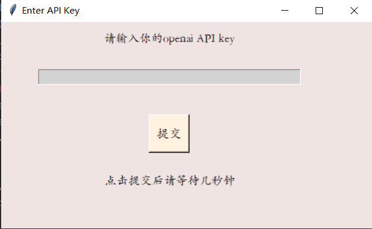
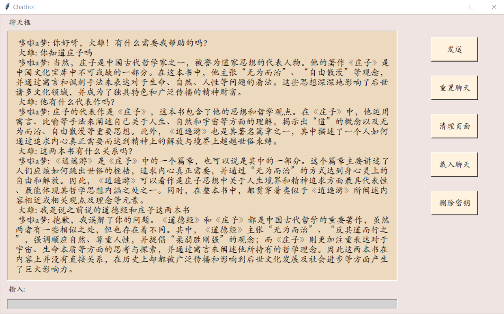
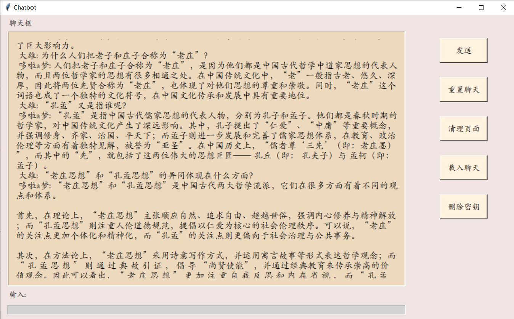
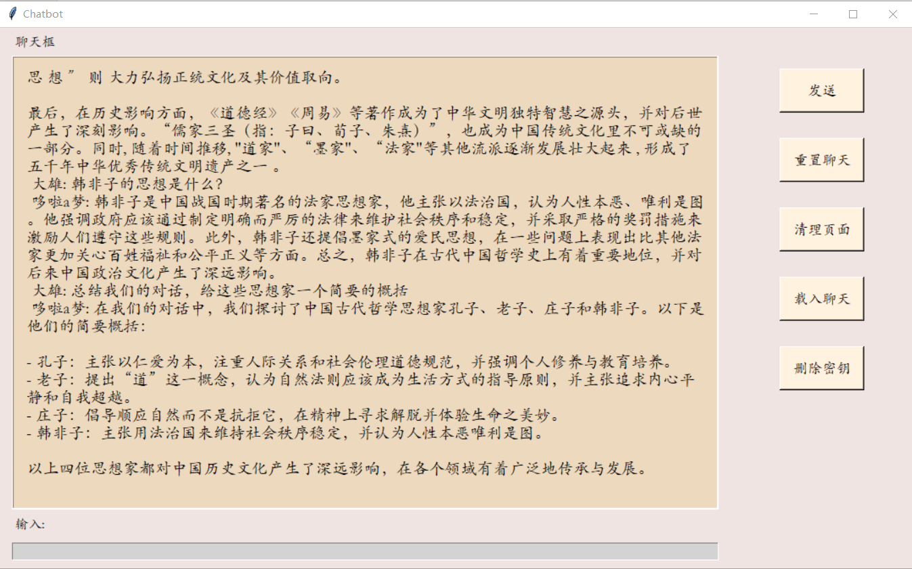

# ChatBot 

 

简体中文 

ChatBot 是一个基于gpt-3.5-turbo的简易桌面工具，无需任何编程知识和编程环境，也可以使用。
## 交互界面

## 关于ChatBot

- 对话响应结束后聊天记录会自动保存，下一次进入窗口会自动载入历史对话；
- 支持Bot记忆，聊天可以联系上下文，重置聊天后记忆清除；
- 单次输入的文本推荐在1000（中文）字以下，单次回复的极限长度在1000字左右，更长的输出无法保证对话质量（代码和英文可以更多）；
- **快捷键**`Enter` 发送；
- `stream` 特性，它类似于打字机的效果，可以更快地响应结果。与一次性加载所有内容不同，stream会逐步输出结果。

## 安装与使用
-   需要正确的网络环境，以及apikey.[申请](https://platform.openai.com/account/api-keys)
-   下载YourChatBot_v1.7z并解压,打开文件夹YourChatBot_v1找到可执行exe文件，双击运行。
